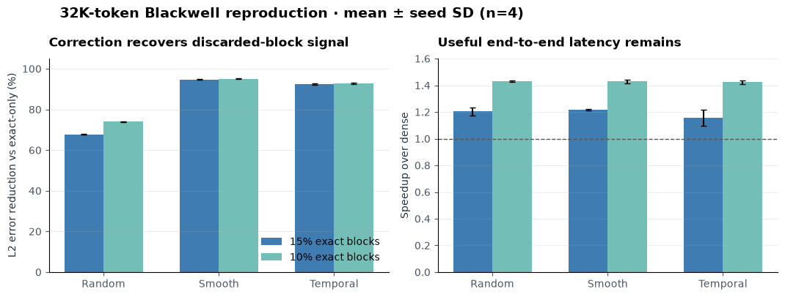
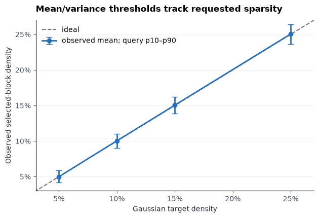
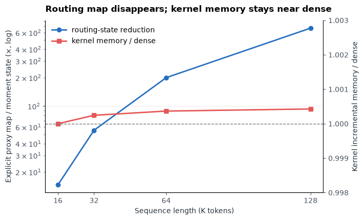
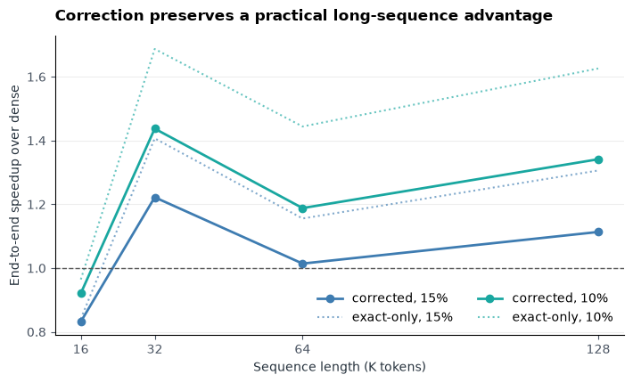
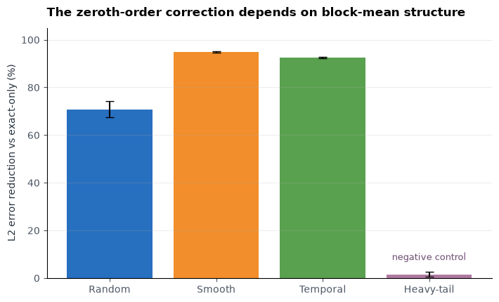

# Sol-Attn, claim by claim: a Blackwell reproduction

Long video generators repeatedly compare thousands of small pieces of a video, making attention expensive. Sol-Attn proposes choosing only the promising regions for exact work and cheaply estimating the rest; this reproduction asks whether that choice stays controllable and whether the estimate earns back accuracy without giving up the speed benefit. We rebuilt those mechanisms and tested them from 4K to 128K tokens.

**Verdict — partially reproduced.** The routing and approximation claims aligned on seeded random and structured tensors: at 32K tokens, correction reduced error by 70.8–94.9% relative to the identical exact-only mask while the fused implementation averaged 1.29–1.32× faster than dense attention. Scope is kernel-level: kernel memory was essentially equal to dense, the released SANA probe was distribution-shifted, and we did not test video quality or the paper’s 2.1–2.3× end-to-end model speedups.



Read the left panel as “how much of exact-only sparse attention’s error the proxy correction removes”; higher is better. The right panel includes routing and correction time, with the dashed line marking dense-attention parity. Bars are means across four seeds, and both methods use exactly the same selected blocks.

[](https://molab.marimo.io/github/alphaXiv/sana-e31d1f5d/blob/main/notebooks/sol_attn_reproduction.py)

## What was reconstructed

We followed arXiv:2607.24027 with 64-token blocks. Each query–key block pair receives a proxy score: the dot product between their mean vectors. For each query block, selection uses its proxy-score mean plus a tunable multiple of its standard deviation. The key-side first and second moments make that threshold computable without writing the quadratic block-by-block proxy map.

Selected blocks use exact scaled dot-product attention. Unselected blocks receive the paper’s zeroth-order correction: one mean-key score and one summed-value vector, accumulated into the same stable softmax state. A matched control skips unselected blocks entirely. The Triton kernel streams 32 key blocks at a time; all accuracy comparisons use dense PyTorch attention as reference.

## Claim 1 — dynamic sparsity without a proxy map

**Assessment: aligned on synthetic tensors; inconclusive on released SANA tensors.** Across four random seeds at 32K, requested 15% and 10% selection produced 15.02% and 10.01%. A wider 5/10/15/25% sweep followed the diagonal, while per-query variation remained visible.



The moment-derived thresholds differed from explicitly materialized proxy-map thresholds by at most \(4.2\times10^{-6}\) on final random runs and \(5.7\times10^{-4}\) on structured runs. BF16 streaming selected counts were within one block of the explicit diagnostic in 97–99% of rows at 32K; at 8K they matched exactly. Crucially, the production path never stores the diagnostic map: its measured routing state was 14.6× smaller at 16K and 668.7× smaller at 128K.



This is a routing-memory result, not a total-memory win. With routing state precomputed, incremental kernel memory was 1.0000–1.0004× dense. The convenient end-to-end Python wrapper retained pooled tensors and used about 2.03× dense incremental memory, so this setup did not show the claimed useful total-memory advantage.

## Claim 2 — correction reduces error and keeps useful speed

**Assessment: aligned for approximation and latency in this kernel test; memory only partially aligned.**

| Tensor family | 32K correction error reduction | 32K speedup over dense |
|---|---:|---:|
| Random | 70.8% | 1.32× |
| Smooth block structure | 94.9% | 1.32× |
| Temporal structure | 92.5% | 1.29× |

These averages combine 15% and 10% selected-block settings over four seeds. At 64K random tensors, correction still removed 70.9% of exact-only error and averaged 1.12× dense; 10% selection was 1.22×. The C32 scaling sweep reached 1.44× at 32K/10% and 1.34× at 128K/10%, below the paper’s up-to-5.41× kernel number because hardware, baseline, shape coverage, and kernel engineering differ.



The correction costs time relative to exact-only sparsity, but its streamed 32-block matrix multiply kept that premium small enough to remain above dense parity in every 32K–128K C32 condition. The 16K conditions were slower than dense, showing a real crossover rather than a universal speedup.

## Robustness and released-model diagnostic

The benefit is not automatic. A clipped heavy-tail negative control saw only 1.3% mean error reduction, versus 70.9–94.9% for families where block means summarize omitted content.



We also captured real query, key, and value tensors from four self-attention layers of the public `Efficient-Large-Model/Sana_600M_512px_diffusers` checkpoint. This is diagnostic, not model validation: that released SANA path uses ReLU linear attention rather than the softmax attention assumed by Sol-Attn. Streaming and explicit routing agreed exactly, and the isolated kernel was 1.48–1.58× dense at 4K, but observed layer densities ranged from 0% to 11% under nominal 10/15% targets. Two deeper probes got about 99.5% correction benefit; layer 0 got essentially none, and one layer selected no exact blocks. The result warns that Gaussian calibration and approximation quality are tensor-distribution dependent.

## Reproduction boundary

The campaign used Kubernetes on NVIDIA RTX PRO 6000 Blackwell GPUs, with a peak of 16 GPUs concurrently allocated as four 4-GPU jobs. The measured experiment wall interval—from the first Kubernetes launch through the last successful terminal run—was 0.43 hours. We ran 16 successful GPU jobs (plus five documented compiler/environment failures), covering 104 published terminal metric rows; every formal run used:

```bash
python -m torch.distributed.run --standalone --nproc_per_node=4 -m sol_attn_repro.run
```

A full reproduction still needs the authors’ production kernels, the paper’s H100/RTX 5090 shapes and baselines, integration into a softmax video transformer, VBench quality, and end-to-end generation timing. The evidence here supports the two mechanisms under controlled tensors, but not the paper’s complete video-model claim.

Data are in [`results/sol_attn/metrics.csv`](../../results/sol_attn/metrics.csv), the executable walkthrough is the [self-contained marimo notebook](../../notebooks/sol_attn_reproduction.py), and the implementation is in [`sol_attn_repro`](../../sol_attn_repro/).
